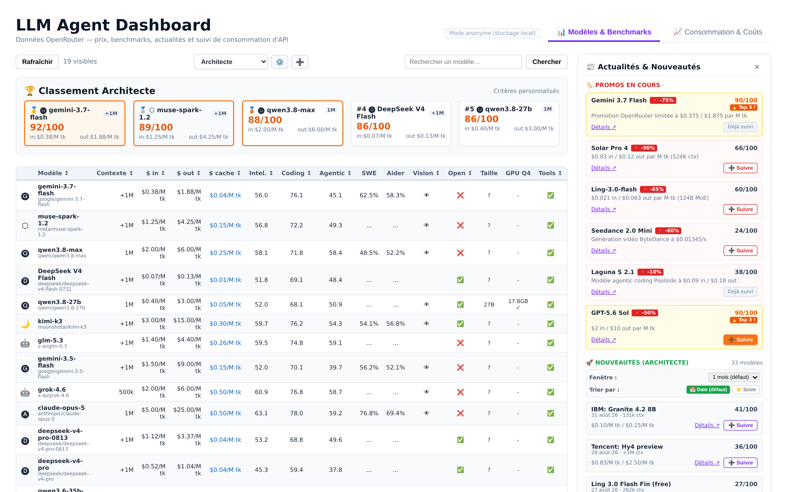
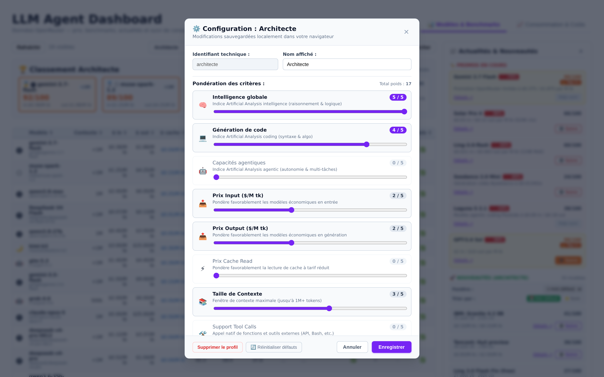

# Hermes Model Leaderboard

A **LLM comparison dashboard** plugin for [Hermes Desktop](https://hermes-agent.nousresearch.com): compare, score and rank LLM models as a full-page `/model-leaderboard` route — prices, benchmarks and OpenRouter news, no configuration needed.

Ported from the reference app `sumaris-agent/docker/llm-dashboard` (live at `http://localhost:3004/`), **first tab only**: authentication, dark-mode toggle and the consumption tab are intentionally out of scope — Hermes Desktop already provides the identity (the plugin runs inside the authenticated desktop context) and the theme (via the standard CSS variables).

## Install

```bash
hermes plugins install e-is/hermes-model-leaderboard --force
hermes plugins enable model-leaderboard
hermes gateway restart
```

Then reload the desktop window (F5 / Cmd+R): **Model Leaderboard** appears in the sidebar.

Notes — the three things that trip people up:

- **`--force` is expected.** The install scanner rates any community plugin `CAUTION`
  (bundled React/recharts regexes read as "obfuscation", `localStorage` as "persistence",
  the auto-fill `subprocess.run` as "execution"). The verdict is `CAUTION`, not
  `DANGEROUS`, so `--force` applies — there is no CRITICAL finding to accept.
- **The plugin key is `model-leaderboard`** (from `plugin.yaml`), *not* the repository
  name `hermes-model-leaderboard`. `hermes plugins enable hermes-model-leaderboard`
  will not match.
- **`enable` asks about built-in tool override** — "Allow this plugin to replace built-in
  tools (e.g. shell_exec, write_file)?". Answer **no**: this plugin registers no agent
  tools at all (its `register()` is a no-op), it only ships a dashboard API router and a
  desktop renderer. To skip the prompt: `hermes plugins enable model-leaderboard --no-allow-tool-override`.

**First run** seeds the tracked-model list from the main model declared by each installed
Hermes profile (`default` first), then persists it to `dashboard/data/models.json`. Delete
that file to re-seed.

## Features

- 📊 **Model comparison** — context window, input/output/cache prices, Artificial Analysis indices (intelligence, coding, agentic), an SWE-bench Verified column, vision/tools support, open-weights, local VRAM estimate.
- ⭐ **Per-profile scoring** — one chip per **Hermes profile** (and `default`), 0–5 weights on 12 criteria, instant re-ranking + top-5 cards. A profile with no saved criteria starts from a sane default (intelligence 5, price 3, rest 0).
- 🤖 **Auto-fill** — a button in the criteria dialog asks the Hermes default model (`hermes -z`, one-shot) to propose weights for that profile. Never automatic, always user-triggered.
- 🔎 **Search** — filters the tracked table live *and* queries OpenRouter for untracked models (checkbox to opt out), with a one-click add.
- 📰 **OpenRouter news** — side panel: promotions (with end dates), price changes (rolling 1 d / 7 d, configurable threshold), new models (sort by date or score, +1-week pagination).
- 🛡️ **Resilience** — 5 min OpenRouter cache, stale-on-error fallback on 429s, plus a visibility-gated auto-pull (cheap local poll every 60 s, real refetch every 10 min — only while the page is visible).
- 🧭 **Native desktop UX** — deletion confirms through the desktop's own `ConfirmDialog` (imported from the plugin SDK), tooltips and labels fully i18n'd (en/fr), styling left to the app's CSS variables.
- 🔑 **No auth plumbing** — profiles always persist backend-side; the desktop supplies identity.

## Architecture (unified Hermes plugin)

Same conventions as [hermes-kanban-gantt](https://github.com/e-is/hermes-kanban-gantt):

| Reference (docker/llm-dashboard) | This repo |
|:---|:---|
| `backend/main.py` (FastAPI :3004, `/api/*`) | `dashboard/plugin_api.py` — FastAPI **router** mounted at `/api/plugins/model-leaderboard/` |
| `backend/data/*.json` | `dashboard/data/` (shipped seed data + runtime state) |
| `frontend/src/App.tsx` + components (React 18, Recharts) | `src/` (TSX) → esbuild → `desktop/plugin.js` (artifact committed, SDK/react external, Recharts bundled) |

```
plugin.yaml          unified plugin manifest  (name: model-leaderboard)
__init__.py          no-op register() (capability probe only)
dashboard/           backend — FastAPI router → /api/plugins/model-leaderboard/
  manifest.json      name/label/version/api pointer
  data/              seed: models, benchmarks
                     runtime (gitignored): openrouter cache, price history
desktop/             BUILD ARTIFACT — renderer loaded uncompiled
src/                 TSX authoring sources (esbuild → desktop/plugin.js)
  core/scoring.ts    pure scoring helpers (unit-tested)
  components/        NewsPanel
  hooks/             useResizable
tests/               pytest backend suite + node unit tests (scoring, path guards)
assets/              screenshots
```

## Build & test

```bash
npm install
npm run build                                      # src/ → desktop/plugin.js
node --experimental-strip-types --test "tests/unit/*.test.ts"   # scoring + path guards
pytest tests/test_backend.py -q                    # backend (23 tests)
```

To iterate without reinstalling: copy `desktop/plugin.js` into
`~/.hermes/plugins/model-leaderboard/desktop/` and reload the desktop window. Remove
`~/.hermes/desktop-plugins/model-leaderboard` if the loader keeps serving the previous
artifact (the lift aborts with `EEXIST` when that folder already exists — a runtime
bug, not a plugin one).

## Data sources

| Data | Source | Refresh |
|:---|:---|:---|
| Prices, context, modalities, AA indices | OpenRouter `GET /api/v1/models` | auto (5 min cache) |
| News: promos, price changes, new models | derived from the same cache + local price history | auto |
| SWE-bench Verified | **curated** in `dashboard/data/benchmarks.json` | manual |

(The multilingual-coverage criterion was removed: OpenRouter exposes no language field and HF
`cardData.language` is empty for current models — see the roadmap below.)

Why the benchmark columns are curated rather than synced — measured, not assumed:

- **Aider polyglot** used to be a column here and was **removed**: the machine-readable
  board (`raw.githubusercontent.com/Aider-AI/aider/main/aider/website/_data/polyglot_leaderboard.yml`)
  stops at the gpt-5 / gemini-2.5 / claude-4 generation — 1 correct match out of 19 tracked
  models, and fuzzy matching paired `deepseek-v3.2-exp` with "DeepSeek V3 (0324)" and
  `grok-4.6` with "grok-4". Wrong numbers are worse than no column.
- **SWE-bench Verified** has no API. The raw data lives in `SWE-bench/experiments`
  (`evaluation/verified/<run>/{metadata.yaml,results/}`, 4355 files) where the headline
  figure depends on the scaffold/agent you pick — an editorial choice, not a derivation.
- **Artificial Analysis** indices are already covered through OpenRouter, which also
  exposes `GET /api/v1/benchmarks?source=artificial-analysis` (154 models, `meta.citation`)
  covering 12/19 tracked models — usable as a gap-filler. Their own Data API is free at
  100 req/24 h but **non-redistributable**, so fetched values must never be committed.

## TODO / roadmap

**Done**

- [x] Dynamic profile list — read from the installed Hermes profiles, `default` included.
- [x] Default weights for new profiles — all criteria 0 except `intelligence: 5` and price 3.
- [x] "Remplissage auto" — one-shot `hermes -z`, plugin-built English prompt, model answers strict JSON.
- [x] First-run seeding from the profile-declared models.
- [x] Real refresh (cache-bypassing) + visibility-gated auto-pull.
- [x] Native confirmation dialog (SDK `ConfirmDialog`) and full en/fr i18n.

**Next**

- [ ] **Benchmark sync** — wire `GET /api/v1/benchmarks?source=artificial-analysis` as a
  gap-filler for the indices (24 h TTL, runtime cache, prefer the plain/"Default Fallback"
  AA variant — "Max Effort" inflates the score), and surface `source + date` next to the
  SWE / aider columns so staleness is visible instead of guessed. Aider stays strict-match
  only (exact slug, explicit alias table); no fuzzy matching.
- [ ] **Recharts v3** (2.x is EOL) or native canvas — see the plugin plan note on bundle weight.
- [ ] **Human-preference rating (LMArena)** — the multilingual criterion was dropped instead
  (OpenRouter exposes no language field; HF `cardData.language` is empty for 0/5 of the tracked
  open-weights models), but LMArena's overall Elo is worth a column: it covers closed models too.
  No API exists (`arena.ai/api/*` → 403 "Route not allowed"; the leaderboard is server-rendered,
  and interaction triggers zero XHR), so it needs a DOM extraction guarded by a structure test.
  Per-language boards are gone from their public UI, so it cannot serve multilingual data.

**Later**

- [ ] Consumption tab → separate plugin ([llm-plugin-plan](../sumaris-agent/data/plans/llm-plugin-plan.md)): usage tracking with credits + analytics.
- [ ] WebSocket push (`ctx.socket`) instead of polling, if multi-window use ever justifies it.

## Reference screenshots

| Models & radar | Profile config |
|:---:|:---:|
|  |  |

## License

GPL-3.0 — see [LICENSE](LICENSE).
